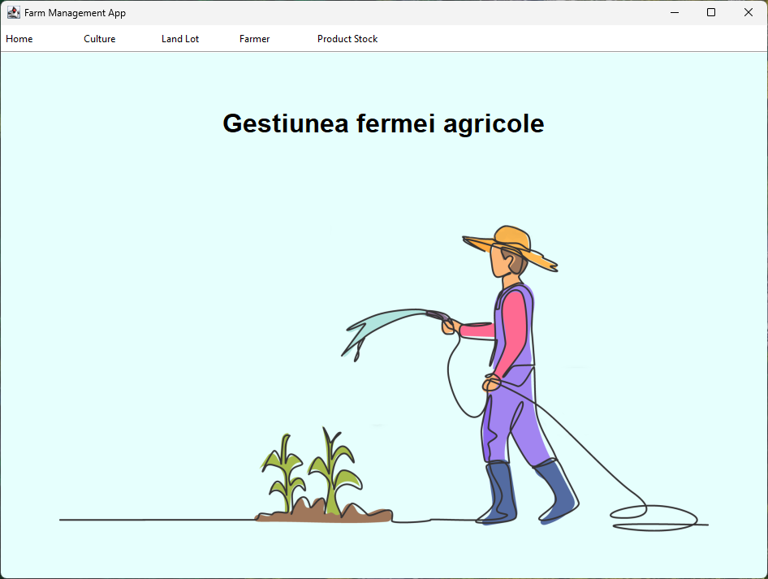
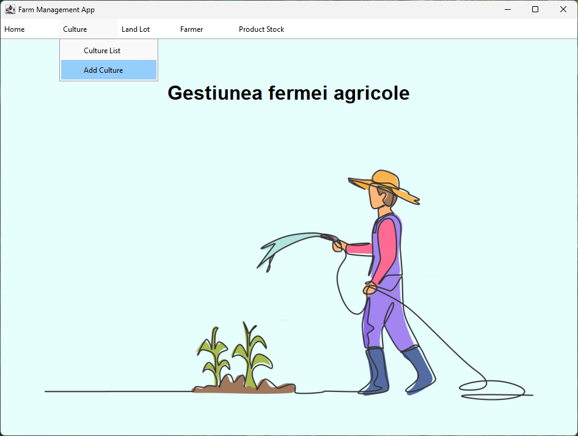
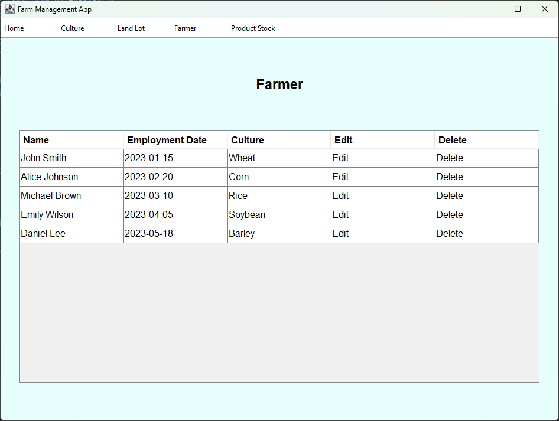
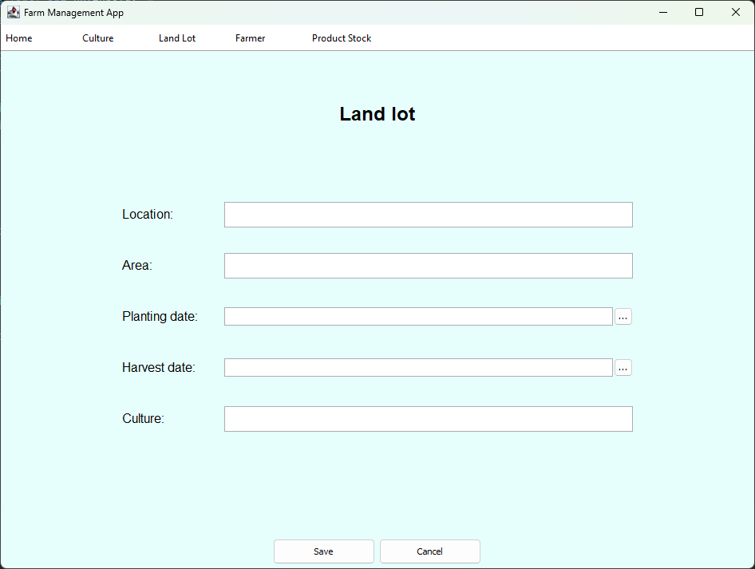
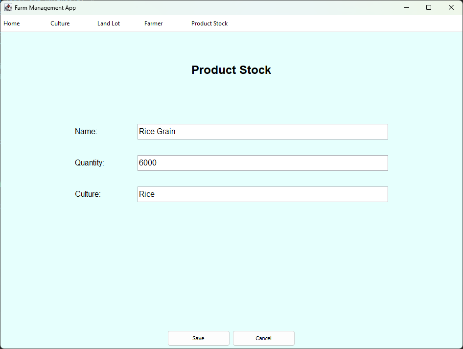

# Farm Management Application - Java with Microsoft SQL Server and JDBC

## Overview

Farm Management Application is a Java-based desktop application designed to assist farmers in managing their farms efficiently. The application utilizes Microsoft SQL Server as the database management system and JDBC (Java Database Connectivity) for communication between the Java application and the database.

## Features

- **Database Integration**: Utilizes Microsoft SQL Server to store farm-related data such as inventory, livestock information, and financial records.
- **CRUD Operations**: Supports basic CRUD (Create, Read, Update, Delete) operations for managing farm data, including adding new entries, modifying existing ones, and deleting records.
- **User Interface**: The application features a user-friendly interface built using AWT (Abstract Window Toolkit) and Swing, providing intuitive navigation and interaction with farm data.
- **Stored Procedures**: Leveraging SQL Server, the application incorporates stored procedures to execute common database operations efficiently.
- **Customization**: Different pages within the application dynamically display farm data based on user actions, enhancing usability and organization.

    
    
    
    

## Requirements

- Java Development Kit (JDK)
- Microsoft SQL Server
- JDBC driver for SQL Server

## Getting Started

To get started with the Farm Management Application, follow these steps:

1. Install and configure Microsoft SQL Server on your system.
2. Run the `create_database.sql` script located in the `sql` folder to create the necessary database schema and tables.
3. Run the `stored_procedures.sql` script located in the `sql` folder to create the required stored procedures.
4. Ensure that you have the JDBC driver for SQL Server installed and configured in your Java project.
5. Clone the repository or download the application source code.
6. Open the project in your preferred Java IDE.
7. Update the database connection credentials in the `DbUtils.java` file to match your SQL Server setup.
8. Build and run the application.

## Development Details

- **Technologies Used**: Java, AWT, Swing, Microsoft SQL Server, JDBC
- **Database Schema**: Define the structure of the database, including tables for inventory, livestock, financial records, etc.
- **Stored Procedures**: Implement stored procedures in SQL Server to encapsulate common database operations and improve performance.
- **User Interface Design**: Utilize AWT and Swing to create an intuitive and visually appealing interface for users to interact with farm data.

## License

This project is not licensed and comes with no warranty or guarantee of any kind. You are free to view and fork the code for personal and educational purposes.

Happy farming with Farm Management Application! 🚜🌾
